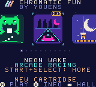

# Chromatic Fun by Youens cartridge

One Game Boy Color ROM containing Neon Wake, Moonthread, Echo Vault, Bloom
Circuit, Orbit Choir, Hello Dot, Stormkite, Comet Links, Prism Well, Dot Swarm
Dreambase Invaders and Dotwing, behind a launcher of its own. Press Start + Select together in any game to return to the
launcher. Best scores and play counts are saved on the cartridge.

## The launcher

| Screen | What it does |
| --- | --- |
| Title card | The Chromatic Arcade logo fades in with a three-note chime. Start or A opens the shelf. |
| Shelf | A 48 × 48 cartridge label for every game on a sliding shelf. ← → (or ↑ ↓) slides it, with the neighbours peeking in from the edges. Below it are the game's name, genre and tagline, page dots, and its saved best score and play count. Unplayed games carry a NEW badge. |
| Game card (B) | A larger label, a two-line pitch, the game's own controls and goal, and its records. A plays, B returns. |
| Hall of Light (Select) | Every game's best score, total plays, and whether the cartridge accepted the save. Left/right changes the records page. Hold A + B for two seconds to erase launcher records. Long names have a short form here (DREAMBASE INV). |

The shelf's icon band scrolls on its own scanline split: an LY=LYC interrupt
changes SCX at line 15 and resets it at line 79. The header and the details
below therefore stay perfectly still while cartridges slide past. Four
64-pixel slots in the 32-tile background map form a ring. Before each slide
the launcher draws the incoming game into the hidden slot and loads its
palette, so nothing visibly redraws. Screens fade through black by scaling
all 16 palettes with a lookup table. Each VBlank carries either palette
writes or a map transfer, never both, so neither overruns the blanking period.

Each game has its own icon, drawn procedurally in
[tools/launcher_art.py](tools/launcher_art.py) with four colours. Dreambase
Invaders' label doubles the game's own Data Analyst sprite; Dotwing's label
shows a smiling Dot at the controls of a mint jet. The unique
icon tiles, deduplicated with flips, live in VRAM bank 1 so they never collide
with a game's tiles. The same script builds the logo, the interface glyphs and
the launcher's text tables. It takes each game's control text straight from
its source.

## Saved records

The cartridge header declares MBC5 with 8 KiB of battery-backed RAM (type
`0x1B`). The launcher keeps a 56-byte record at `0xA000`: a magic word, a
version, the last game played, and a best score and play count for each game,
protected by a checksum. It reads the record at boot and writes it before and
after each game. If the check fails, or the cartridge has no RAM, it starts
fresh and the Hall of Light reports `NO SAVE MEMORY`. RAM is enabled only
while the record is being copied.

Save format version 4 adds Dotwing as the twelfth entry. Cartridges saved by
the ten-game release (version 2) or eleven-game release (version 3) keep every
checksum-verified best score and play count. The launcher copies them into
the new layout, starts new entries with no plays, and opens the shelf on
Dotwing once. Anything else that fails the check starts fresh, as before.
Dotwing keeps its pilot, token wallet and permanent upgrades separately at
`0xA200`, so migrations and erasing launcher records preserve those choices.

The shared-runtime games still keep their own best score in memory. The
launcher hands each game its saved best before starting it and stores any
higher score when it returns. Hello Dot works the same way through
`best_score`, Dreambase Invaders through `db_best`, and Dotwing through `dw_best`.

## Build and test

From this directory, run `make release`. This builds every game's standalone
ROM and generated headers (without running their tests, which rewrite tracked
screenshots), generates the banked collection, runs the PyBoy integration
test, and copies the verified ROM, its SHA-256 checksum, and the launcher
screenshots into `dist/` and `art/`.

The build uses the pinned GBDK toolchain in the repository's `.tools` directory.
The standalone games remain separate releases. Generated translation units
are in `build/`; edit `tools/build.py`, `tools/launcher_art.py`,
`src/menu.c`, `src/shelf.c` or the original game sources instead.

The 512 KiB cartridge has 32 banks:

| Bank | Contents |
| --- | --- |
| 0 | Shared runtime, game dispatch, the launcher's entry point and scanline interrupt handlers (`src/shelf.c`), Stormkite's scanline interrupt handlers, Dreambase Invaders' fixed helpers (`fixed.c`) and Dotwing's VBlank sound hook (`vbl.c`) |
| 1–18 | Code and graphics modules of the nine shared-runtime games, packed together by GBDK's `bankpack`; about seven banks are used and the rest stay empty for future games |
| 19–20 | Hello Dot, which keeps its own engine |
| 21 | Launcher tiles and icons |
| 22–25 | Dreambase Invaders, which keeps its own engine: frame loop and sound, screens, gameplay, graphics |
| 26–31 | Dotwing, which keeps its own engine with the same module pairs as its standalone cartridge: frame loop, sound and sectors 1–2; screens and sectors 3–4; flight; loaders and title art; helpers, saves and rival AI; scenery streaming and bosses |
| 31 | Also the launcher (`src/menu.c`): drawing, menus, screen setup, its text tables and the battery records |

The build fails if any bank overflows or two areas overlap (the linker only
warns), and prints how many of banks 1–18 are empty.

`tools/build.py` finds every symbol a game defines by reading SDCC's own
assembly output, then gives it a `g<N>_` prefix. Games therefore link
together without hand-kept symbol lists. Dreambase Invaders is compiled with
`ARCADE` defined, which turns its `main` into `dreambase_run` and adds the
Start + Select check; its globals already carry `db_`, `pl_`, `pr_` and `pk_`
prefixes. Dotwing is also compiled with `ARCADE`, using `dotwing_run` and
the same Start + Select return. Returning to the launcher undoes any
hardware a game claimed: its interrupt handlers, scroll registers, sprite
size and sound.

Low work RAM (`0xC000`–`0xCFFF`) holds every game's ordinary globals all the
time, so large buffers live in upper work RAM instead, which only the
running game uses:

| Range | While it runs |
| --- | --- |
| `0xD000`–`0xD7FF` | Shared-runtime games and the launcher: screen tiles and colours. Dreambase Invaders: map, attributes, actors, palettes (to `0xD7DF`) |
| `0xD800`–`0xDBFF` | Shared-runtime games: the arrays `tools/build.py` moves out of low work RAM (Echo Vault's maze, seen, stack and distance map; Dot Swarm's snakes and food; Bloom Circuit's boards and undo history; Prism Well's board and marks) |
| `0xD000`–`0xDBFF` | Dotwing: buffers, actor pools, palettes and scenery tables |
| `0xDC00`–`0xDFFF` | The stack, for everyone |

The build moves each listed array with `__at` and leaves the standalone
games untouched. Every moved array is rebuilt by its game's reset or written
before it is read, so a launch never depends on what another game left
there. The build fails if ordinary globals reach `0xD000` or a game's moved
arrays pass `0xDBFF`, and reports the low work RAM left.

The emulator test checks the header and checksums, and the intro, shelf,
game card and Hall of Light screens. It fills `0xD800`–`0xDBFF` with a
pattern before launching each game that uses it and confirms the game
rebuilt its arrays, and it paints the stack's room to confirm the deepest
stack use (about 150 bytes) stays far above `0xDC00`. It checks that the
header stays fixed during a slide, and that selection wraps both ways. It launches every game
twice, checking help, gameplay, the 30 Hz update rate of the
shared-runtime games, pause and resume, and the return. For Dreambase
Invaders it checks the brand splash, title, instructions, movement at 60 Hz,
pause, and the return. It drives a full Neon Wake round to earn a real score,
power-cycles the emulator with the saved RAM, and confirms the score, play
counts and last game come back. It erases the records, then boots a
version 2 and version 3 saves and confirms every record carries over. Dotwing
also checks its builder, flight, pause, return and independent SRAM region.
Screenshots and machine-readable results are
written under `build/`. The anthology ROM also runs in the site's binjgb
player, but neither check establishes physical cartridge play.

## Connected hardware

On September 29, 2026, the official device tools identified the connected
Chromatic as Player 1 and its cartridge flash as an ISSI IS29GL032-70TLET-TR
with 4 MiB capacity and 64 KiB sectors. Its existing ROM title was `OPENAI`;
the header reported MBC5 with rumble, RAM and battery. No existing cartridge
content was backed up. The Hello Dot USB demo completed successfully, which
validates host streaming but not installation or native cartridge gameplay.

Installing this anthology replaces the cartridge's current ROM. Obtain the
owner's explicit data-loss acknowledgement before its first write. Keep the
exact inspected ROM hash bound to the device write, and verify the completed
operation before attempting another device action. The anthology uses the
cartridge's RAM for saves and writes only RAM bank 0, which leaves the rumble
bit of the MBC5 RAM-bank register clear. Writing this build keeps the saved
records of the ten-game release, as described under Saved records.

The user has enabled Developer Mode and explicitly requested installing the
complete ten-game collection. Their collection-only preference is recorded in
the root AGENTS.md. Earlier six- and seven-game writes succeeded; those results
are not evidence that this new build has been installed. The final write is
recorded below after the vendor operation settles.

Dot Swarm preserves its moderate movement speed and safe self-crossing rules.
The launcher uses the sliding shelf from PR #1 with Chromatic Fun by Youens
branding and a persistent Start+Select home reminder. Save format version 2
separates the ten-game records layout from the earlier nine-game layout.

## Latest installation

The ten-game release was written successfully to Player 1 on September 29, 2026.
Vendor operation: de25e37568e07b02ee644de60a36a46813c3f50d7e80000b3e756c56c6bbf7ad.
SHA-256: e279423ce6e7fd8376fbffdb6a807f3c12ca81358e9a9559b29fe14125a27f8a.
Size: 524288 bytes. The vendor reported success and process closure was observed.
All ten games launch and return in emulator tests. Physical gameplay and
battery-backed save persistence have not yet been observed on this device.

## Pending installation

The current build adds Dreambase Invaders and Dotwing to the last installed
ten-game release. Its verified SHA-256 is written to `dist/SHA256SUMS` by
`make release`. Size: 524288 bytes. This update has not been written to Player 1.
