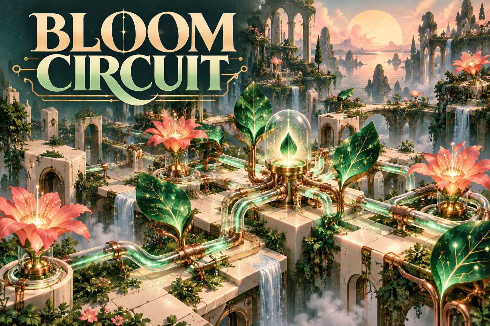
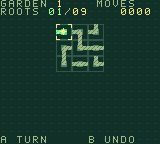

# Bloom Circuit

**[Play online](https://chromatic.youens.com/games/bloom-circuit/)** · [Download the GBC ROM](dist/bloom-circuit.gbc)

Rotate glass roots until an entire garden wakes up. Each connection carries light from a single seed, growing from a tiny patch into a sprawling botanical circuit.



## How to play

Connect every tile to the golden seed at the top-left. Complete five increasingly large gardens. No clock, no damage, and up to 64 moves of undo.

| Control | Action |
| --- | --- |
| D-pad / Arrows | Choose root |
| A / X / Space | Rotate clockwise |
| B / Z | Undo |
| Start / Enter | Start, pause, resume |
| Select / M | Toggle sound |

On the title screen, B opens the instructions. After a round, A or Start replays,
and B returns to the title. Best scores last for the current power-on session.

## What makes it different

Solvable spanning-tree generation, live network traversal, 16 connection patterns and palette-cycled growth.



These are native 160 × 144 cartridge graphics. The illustrated cover is separate
key art. Each project has a custom palette and pixel art, generated reproducibly
by [../shared/assets.py](../shared/assets.py).

## Build

Requires GBDK 4.5.0 and Python 3. From the repository root on Apple Silicon macOS:

```sh
./games/hello-dot/tools/setup.sh
make -C games/bloom-circuit release
```

For another platform, install the appropriate official GBDK build and supply
`GBDK_HOME=/absolute/path/to/gbdk` to Make. Output is a 32 KiB, Color-only,
ROM-only cartridge at `dist/bloom-circuit.gbc`. SHA-256 is in `dist/SHA256SUMS`.
The source shares [a small CGB runtime](../shared/README.md) but has its own game
implementation in `src/main.c`.

## Validation and scope

Run `.tools/venv/bin/python tools/test_collection.py` from the repository root.
Test dependencies are pinned in `games/hello-dot/tools/requirements-test.txt`.
These are complete first playable editions with menus, objectives, scoring,
replay, and controls. Cartridge headers, update timing, and game progression are
checked in emulation. Physical Chromatic testing is still pending.

No network, AI API, special firmware, or battery-backed storage is required.
Use a compatible rewritable cartridge to play on your Chromatic. See the
[hardware development guide](../../docs/development.md) for loading options.

Cover-art provenance: [art/README.md](art/README.md).
GBDK runtime license: [../hello-dot/licenses/GBDK.txt](../hello-dot/licenses/GBDK.txt).
