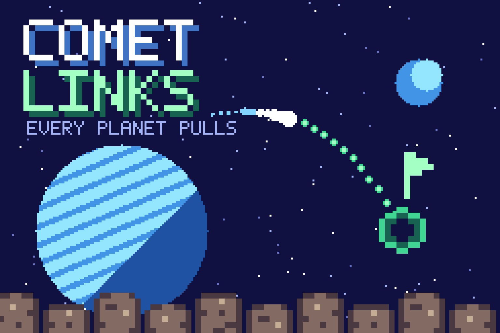
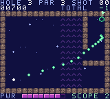

# Comet Links

**[Play online](https://chromatic.youens.com/games/comet-links/)** · [Download the GBC ROM](dist/comet-links.gbc)

Nine holes across an asteroid belt where every planet bends your putt. Slingshot around moons, ride the solar wind, skirt black holes, and sink a tiny comet into each wormhole cup.



## How to play

Sink all nine holes in as few strokes as you can; the course par is 31. The scope traces the real path, gravity included. You start with three and earn one for every birdie.

| Control | Action |
| --- | --- |
| ← → | Aim |
| ↑ ↓ | Power |
| A / X / Space | Putt |
| B / Z | Scope the true path |
| Start / Enter | Start, pause, resume |
| Select / M | Toggle sound |

On the title screen, B opens the instructions. After a round, A or Start replays,
and B returns to the title. Best scores last for the current power-on session;
the [Chromatic Arcade cartridge](../arcade/) saves them.

The full design, including every number, is in [DESIGN.md](DESIGN.md).

## What makes it different

A course compiler folds planets, black holes and wind into a force vector for every tile, so the cartridge physics is integer addition. The scope runs that same physics ahead, so its prediction is exact.



These are native 160 × 144 cartridge graphics. The cover is a pixel poster built
from the cartridge's own tiles, sprites and palette; see
[art/README.md](art/README.md). Native pixel assets are generated reproducibly by
[../shared/worlds.py](../shared/worlds.py).

## Build

Requires GBDK 4.5.0 and Python 3. From the repository root on Apple Silicon macOS:

```sh
./games/hello-dot/tools/setup.sh
make -C games/comet-links release
```

For another platform, install the appropriate official GBDK build and supply
`GBDK_HOME=/absolute/path/to/gbdk` to Make. Output is a 32 KiB, Color-only,
ROM-only cartridge at `dist/comet-links.gbc`. SHA-256 is in `dist/SHA256SUMS`.
The source shares [a small CGB runtime](../shared/README.md). The game is in
`src/main.c`. The nine holes live in [tools/course.py](tools/course.py), which
compiles them into `build/course.h` and holds the Python copy of the physics.
Run `python3 tools/course.py --check` to replay every hole with the planner.

## Validation and scope

Run `.tools/venv/bin/python tools/test_collection.py` from the repository root.
Test dependencies are pinned in `games/hello-dot/tools/requirements-test.txt`.
The suite checks the cartridge header, the 30 Hz update rate, help and pause.
A joypad-driven bot then completes the whole game in the emulator, so this
proves the game can be finished, not how hard it is for a person. Physical
Chromatic testing is still pending.

No network, AI API, special firmware, or battery-backed storage is required.
Use a compatible rewritable cartridge to play on your Chromatic. See the
[hardware development guide](../../docs/development.md) for loading options.

GBDK runtime license: [../hello-dot/licenses/GBDK.txt](../hello-dot/licenses/GBDK.txt).
