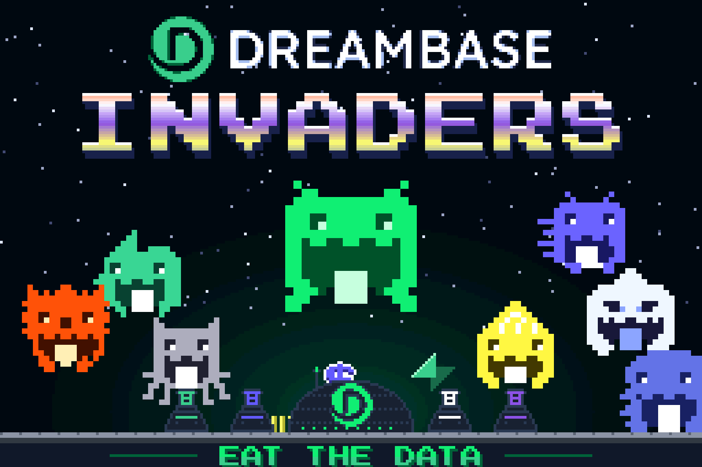
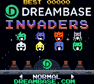
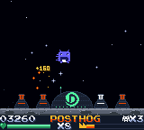

# Dreambase Invaders

**[Play online](https://chromatic.youens.com/games/dreambase-invaders/)** · [Download the GBC ROM](dist/dreambase-invaders.gbc)

Space Invaders, flipped. You are the Dreambase Data Analyst, floating above
a lunar base whose turrets fire partner logos straight up at you. Eat the
data: every logo you gulp fills the power meter, and a full meter means you
absorb that company and transform. Supabase, Stripe, PostHog, Vercel,
GitHub, ClickHouse, Linear, and finally Dreambase itself.



A Game Boy Color edition of the Dreambase Invaders web game, rebuilt for the
160 × 144 screen with native pixel art, a brand splash, and its own sound.

## How to play

| Control | Action |
| --- | --- |
| D-pad / Arrows | Move in eight directions |
| A or B / X or Z | Dash (short burst, about two-thirds of a second to recharge) |
| Start / Enter | Start, pause, resume |
| Select / M | Toggle sound |
| ← → on the title | Easy, Normal or Hard |

- Touch a rising logo to eat it. Catching is generous: anything within 12
  pixels of your centre counts.
- A logo that escapes off the top drains your life bar. Each catch heals a
  little. An empty bar costs one of three lives.
- Streaks of 5, 10 and 15 catches without a miss pay x2, x4 and x8.
- Fill the meter to clear the level. A level with no misses pays a perfect
  bonus. An extra life arrives at 5,000 points.
- Clear all eight stacks for the credits.

On the title screen, B opens two pages of instructions, the second of which
introduces every partner logo. After a run, A plays again and B returns to the
title. Best scores last for the current power-on; the
[Chromatic Arcade cartridge](../arcade/) saves them.

The full design, including every number, is in [DESIGN.md](DESIGN.md).

## The launch screen

- **Brand splash.** The Dreambase mark draws itself tile by tile, white-hot
  and cooling to Dreambase green. The wordmark types in, the mark glints, and
  DREAMBASE.COM appears. Any button skips it.
- **Copper INVADERS.** A scanline interrupt gives every line of the INVADERS
  lettering its own colour: a gradient through every partner's brand colour
  that climbs continuously. Every few seconds the letters ripple, each line
  with its own horizontal offset.
- **A shine on the wordmark.** Two more interrupts sweep a four-line band
  down DREAMBASE, turning the white letters green and the green mark white.
- **The formation.** All eight company invaders march in Space Invaders
  steps while the lunar base's turrets telegraph and fire logos up at them.
  Each invader gulps its logo with a spark burst. Shooting stars cross behind
  the lettering.
- An original title theme, the "EAT THE DATA" tagline alternating with your
  best score, and DREAMBASE.COM on the moon.



## What makes it different

The starfield scrolls on the background layer while the lunar base and the
HUD sit on the window layer, so the stars drift past a moon that never moves.
Logos rise out of the turret barrels and the dome because those tiles have
background priority. Sprites run in 8 × 16 mode, so each 16 × 16 invader or
logo costs two hardware sprites; projectile draw order rotates each frame,
so a crowded scanline flickers instead of dropping a logo. The game updates
at the full 60 Hz.

A wave-channel heartbeat quickens as the meter fills, like the Space Invaders
march. Each level-up flashes the analyst between its old form, white and its
new form, then announces the next company between two of its logos.



These are native cartridge graphics. The Dreambase mark and wordmark were
traced from the official vector artwork at their final pixel sizes; the
invaders, partner logos, font, base and title lettering are drawn in
[tools/art_data.py](tools/art_data.py) and [tools/assets.py](tools/assets.py).
See [art/README.md](art/README.md) for the cover and screenshots.

Partner names and logo marks belong to their owners. They appear here as
pixel reinterpretations of the marks used by the web edition.

## Build

Requires GBDK 4.5.0 and Python 3. From the repository root on Apple Silicon macOS:

```sh
./games/hello-dot/tools/setup.sh
make -C games/dreambase-invaders release
```

For another platform, install the appropriate official GBDK build and supply
`GBDK_HOME=/absolute/path/to/gbdk` to Make. Output is a 32 KiB, Color-only,
ROM-only cartridge at `dist/dreambase-invaders.gbc`. SHA-256 is in
`dist/SHA256SUMS`.

| File | Contents |
| --- | --- |
| `src/main.c` | Entry point, frame loop, fades, music and sound effects |
| `src/screens.c` | Brand splash, title, how to play, results and credits |
| `src/play.c` | The game |
| `src/art.c` | Every routine that reads tile or map data |
| `src/fixed.c` | VBlank and scanline handlers, row and palette transfer |
| `tools/assets.py` | Builds tiles, maps and palettes from `tools/art_data.py` |
| `tools/cover.py` | Website artwork |
| `tools/test.py` | Emulator test |

Unlike most of the collection, the game does not use the shared runtime. It
is split so the anthology can bank it: `fixed.c` must stay in the fixed bank,
and each other module fits a 16 KiB bank. Big working memory (map shadows,
projectile and particle pools, palette buffers) lives at `0xD000`-`0xD7FF`,
the area the shared runtime uses for its screen buffers, so the game adds
little to the anthology's work RAM. Built standalone, everything links into
one 32 KiB ROM.

## Validation and scope

Run `make -C games/dreambase-invaders test`. Test dependencies are pinned in
`games/hello-dot/tools/requirements-test.txt`. The test checks the header and
checksums, the splash and title, a 25-second formation march, the difficulty
selector, both instruction pages, movement and dash, pause, life drain on a
miss, and game over keeping the best score. A joypad-driven bot then plays
all eight levels on Normal through to the credits, and the test requires at
least 99% of play frames to be full 60 Hz updates. The bot reads logo
positions from memory, so the test proves the game can be finished, not how
hard it is for a person. A slower bot with a human-like reaction delay won
Easy and Normal and lost on Hard at level seven during tuning.

The title's per-scanline colour effects were also checked in binjgb, the
emulator the website uses. Physical Chromatic testing is still pending.

No network, special firmware, or battery-backed storage is required. Use a
compatible rewritable cartridge to play on your Chromatic. See the
[hardware development guide](../../docs/development.md) for loading options.

GBDK runtime license: [../hello-dot/licenses/GBDK.txt](../hello-dot/licenses/GBDK.txt).
