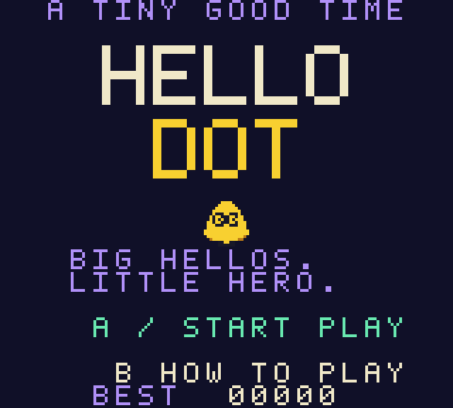

# Hello Dot

A tiny solo arcade game for **Game Boy Color and ModRetro Chromatic**, inspired by the yellow Alfred character in OpenAI's September 29, 2026 [Dots announcement](https://openai.com/index/introducing-dots/).

Chase sparks, dash through bugs, and make the biggest hello you can in sixty seconds.



## Play now

**[Play at hellodot.youens.com](https://hellodot.youens.com)**

The ready-to-load cartridge image is [dist/hello-dot.gbc](dist/hello-dot.gbc), version 0.1.0. It is a 32 KiB, Color-only ROM with no cartridge RAM, battery, mapper, network, or external asset requirements. Use a compatible rewritable cartridge to play it on Chromatic. Physical hardware testing is still pending; the exact DevDay cartridge bundle has not been confirmed.

The browser player runs **that same ROM**, unchanged, in the bundled binjgb emulator. There is no separate JavaScript version of the game.

With Node.js and Portless installed, from the repository root:

```sh
make -C games/hello-dot play
```

Open the URL printed by Portless, normally **https://hello-dot.localhost**. Click the play button to start with sound. The browser player also supports touch controls and a ROM download. It needs no package installation or external web assets.

## Controls and scoring

| Action | Chromatic / GBC | Browser |
| --- | --- | --- |
| Move | D-pad | Arrow keys or WASD |
| Dash | A | X or Space |
| Precision movement | Hold B | Hold Z or Shift |
| Start, pause, resume | Start | Enter or P |
| Sound | Select | M or sound button |
| Help on title / return from results | B | Z |

You have three hearts. Touching a pink bug costs a heart and breaks the combo. **Dash through bugs** for bonus points and protection during the dash. Release and press A again for the next dash; its recharge takes about 0.8 seconds, shown at the bottom left.

- Sparks score 10 × your multiplier. Each four consecutive sparks raises the multiplier, to ×8. Keep collecting within three seconds to hold the chain.
- A bug popped during a dash scores 25 × the multiplier and refreshes the chain timer.
- Every five sparks triggers a **HELLO!** burst: 100 × the multiplier, a clear arena, brief protection, and an immediately recharged dash.
- Every second burst restores one heart, up to three.
- More bugs join at 15 and 30 seconds. A round ends when time or hearts run out.
- The best score lasts for the current power-on session. Resetting the ROM or reloading the webpage clears it.

The round is 3,600 display frames, approximately 60.3 seconds at the Game Boy's native 59.73 Hz refresh. Gameplay uses CGB double-speed CPU mode and one update per display frame.

## Build from source

Requires GBDK **4.5.0**, Python 3, and Make. A C compiler is needed for the logic tests. On Apple Silicon macOS:

```sh
./games/hello-dot/tools/setup.sh
make -C games/hello-dot
```

The installer downloads the pinned official GBDK release, checks its SHA-256, and places it in the ignored `.tools/gbdk` folder. On another platform, get [GBDK 4.5.0](https://github.com/gbdk-2020/gbdk-2020/releases/tag/4.5.0) for your OS and run:

```sh
make -C games/hello-dot GBDK_HOME=/absolute/path/to/gbdk
```

Build output: `build/hello-dot.gbc`. `make preview` builds the ROM and starts the browser player through Portless. `make release` runs the checks and updates `dist/hello-dot.gbc` and its checksum. `make play` uses the prebuilt distribution without requiring GBDK.

## Verification

```sh
make -C games/hello-dot test
uv venv --python 3.12 .tools/venv
uv pip install --python .tools/venv/bin/python -r games/hello-dot/tools/requirements-test.txt
.tools/venv/bin/python games/hello-dot/tools/smoke.py
```

Logic tests cover movement, dash edges and recharge, chains, bursts, healing, invulnerability, scoring saturation, round completion, deterministic seeded input, and arena bounds. Header tests verify the ROM type, size, and both cartridge checksums.

The PyBoy smoke test boots the compiled ROM, checks help and replay, verifies one update per display frame, confirms that pause freezes time, then plays a complete round through joypad input. It also saves screenshots. The browser player has been checked in Chrome with the same ROM. These checks do not substitute for a physical Chromatic test.

## Files and credits

- `src/game.c`: portable deterministic game rules.
- `src/main.c`: GBC graphics, controls, HUD, menus, music, and effects.
- `tools/assets.py`: original editable pixel patterns, font, and tile generator.
- `web/`: local player, powered by [binjgb](https://github.com/binji/binjgb).
- `dist/`: ready-to-use ROM and SHA-256 checksum.
- [DevDay research and visual references](docs/devday-2026.md).
- [Hardware and loading guide](../../docs/development.md).

binjgb's JS and WASM are vendored from commit `16621111ed0ee73bcc45c912a823bcebedcffc0f`, with its MIT license at [web/vendor/LICENSE](web/vendor/LICENSE). Game artwork and sounds were created for this project. OpenAI's Dot character is the visual inspiration; Hello Dot is an unofficial fan project with no OpenAI API dependency.

The GBDK runtime linking exception and license are included in [licenses/GBDK.txt](licenses/GBDK.txt). The compiler/toolchain remains a separate local development dependency.

## Production deployment

Hosted on the existing Youens Cloudflare account with Workers Static Assets.
`wrangler.jsonc` configures the custom domain `hellodot.youens.com`.
Only `web/` is uploaded; the GitHub repository remains private.

To publish the checked-in ROM and current browser player, authenticate Wrangler
to the Youens account, then run from the repository root:

```sh
make -C games/hello-dot deploy
```

For game changes, run `make -C games/hello-dot release` first to rebuild and test
the distribution ROM. Deployment checks the ROM header and checksum before upload.
Cloudflare manages the domain routing and HTTPS certificate.

## Link previews

The public page serves Open Graph and X large-image card metadata directly in its HTML.
Share artwork is at `web/images/hello-dot-share-v1.png`; the [generation prompt and provenance](docs/share-artwork.md) are documented.
Use a new image filename when changing the art to avoid stale image caches.
