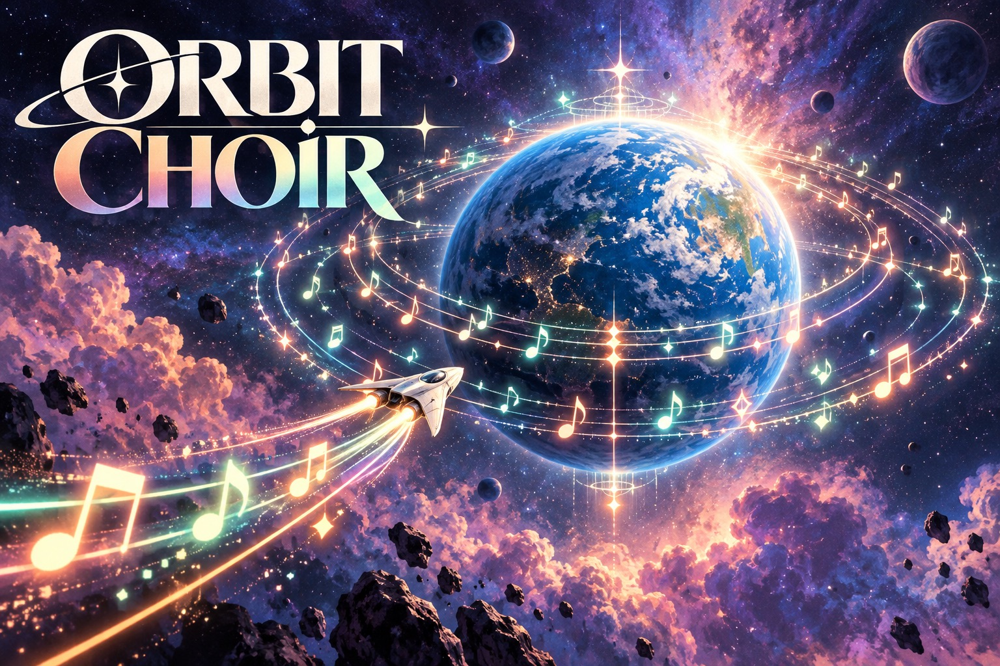
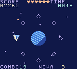

# Orbit Choir

**[Play online](https://chromatic.youens.com/games/orbit-choir/)** · [Download the GBC ROM](dist/orbit-choir.gbc)

Conduct a cosmic chorus from a ship circling a blue planet. Rotate into position and strike each incoming note as it lights up on your orbital ring.



## How to play

Hit mint notes when they reach your ring. Eight hits charge a nova that clears notes and repairs a heart. Protect the planet for sixty seconds.

| Control | Action |
| --- | --- |
| ← → | Orbit |
| A / X / Space | Strike a note |
| B / Z | Harmony nova |
| Start / Enter | Start, pause, resume |
| Select / M | Toggle sound |

On the title screen, B opens the instructions. After a round, A or Start replays,
and B returns to the title. Best scores last for the current power-on session.

## What makes it different

Eight-lane polar motion, timing windows, note-mapped synthesis, combo scoring and palette pulses.



These are native 160 × 144 cartridge graphics. The illustrated cover is separate
key art. Each project has a custom palette and pixel art, generated reproducibly
by [../shared/assets.py](../shared/assets.py).

## Build

Requires GBDK 4.5.0 and Python 3. From the repository root on Apple Silicon macOS:

```sh
./games/hello-dot/tools/setup.sh
make -C games/orbit-choir release
```

For another platform, install the appropriate official GBDK build and supply
`GBDK_HOME=/absolute/path/to/gbdk` to Make. Output is a 32 KiB, Color-only,
ROM-only cartridge at `dist/orbit-choir.gbc`. SHA-256 is in `dist/SHA256SUMS`.
The source shares [a small CGB runtime](../shared/README.md) but has its own game
implementation in `src/main.c`.

## Validation and scope

Run `.tools/venv/bin/python tools/test_collection.py` from the repository root.
Test dependencies are pinned in `games/hello-dot/tools/requirements-test.txt`.
These are complete first playable editions with menus, objectives, scoring,
replay, and controls. Cartridge headers, update timing, and game progression are
checked in emulation. Physical Chromatic testing is still pending.

No network, AI API, special firmware, or battery-backed storage is required.
Use a compatible rewritable cartridge to play on your Chromatic. See the
[hardware development guide](../../docs/development.md) for loading options.

Cover-art provenance: [art/README.md](art/README.md).
GBDK runtime license: [../hello-dot/licenses/GBDK.txt](../hello-dot/licenses/GBDK.txt).
