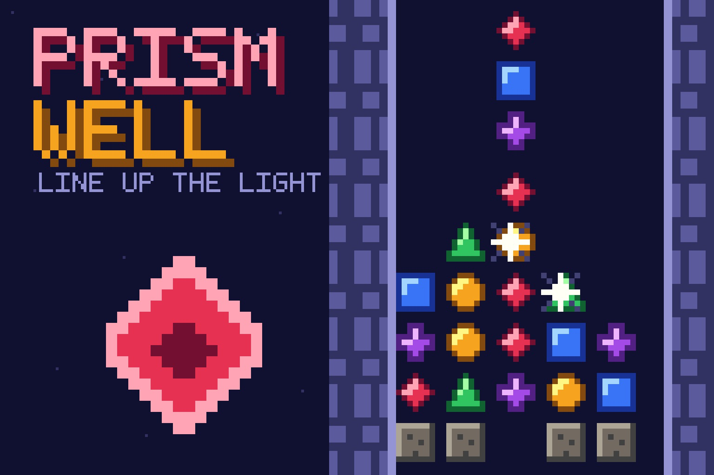
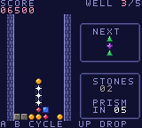

# Prism Well

**[Play online](https://chromatic.youens.com/games/prism-well/)** · [Download the GBC ROM](dist/prism-well.gbc)

Crystals of colored light fall into an old mine well. Cycle each trio, line up three or more in any direction, and let the cascades break the ancient stone at the bottom.



## How to play

Shatter 30 lights in the first well, then break every stone in four deeper wells. Every twentieth piece is a prism that clears every crystal of the color it lands on.

| Control | Action |
| --- | --- |
| ← → | Move |
| A / X / Space | Cycle colors down |
| B / Z | Cycle colors up |
| ↑ / ↓ | Drop / soft drop |
| Start / Enter | Start, pause, resume |
| Select / M | Toggle sound |

On the title screen, B opens the instructions. After a round, A or Start replays,
and B returns to the title. Best scores last for the current power-on session;
the [Chromatic Arcade cartridge](../arcade/) saves them.

The full design, including every number, is in [DESIGN.md](DESIGN.md).

## What makes it different

Four-direction match scanning, animated gravity cascades, chain scoring, a distinct glyph for every color, and wave-channel chimes that climb with each chain.



These are native 160 × 144 cartridge graphics. The cover is a pixel poster built
from the cartridge's own tiles, sprites and palette; see
[art/README.md](art/README.md). Native pixel assets are generated reproducibly by
[../shared/worlds.py](../shared/worlds.py).

## Build

Requires GBDK 4.5.0 and Python 3. From the repository root on Apple Silicon macOS:

```sh
./games/hello-dot/tools/setup.sh
make -C games/prism-well release
```

For another platform, install the appropriate official GBDK build and supply
`GBDK_HOME=/absolute/path/to/gbdk` to Make. Output is a 32 KiB, Color-only,
ROM-only cartridge at `dist/prism-well.gbc`. SHA-256 is in `dist/SHA256SUMS`.
The source shares [a small CGB runtime](../shared/README.md). The game is in
`src/main.c`.

## Validation and scope

Run `.tools/venv/bin/python tools/test_collection.py` from the repository root.
Test dependencies are pinned in `games/hello-dot/tools/requirements-test.txt`.
The suite checks the cartridge header, the 30 Hz update rate, help and pause.
A joypad-driven bot then completes the whole game in the emulator, so this
proves the game can be finished, not how hard it is for a person. Physical
Chromatic testing is still pending.

No network, AI API, special firmware, or battery-backed storage is required.
Use a compatible rewritable cartridge to play on your Chromatic. See the
[hardware development guide](../../docs/development.md) for loading options.

GBDK runtime license: [../hello-dot/licenses/GBDK.txt](../hello-dot/licenses/GBDK.txt).
