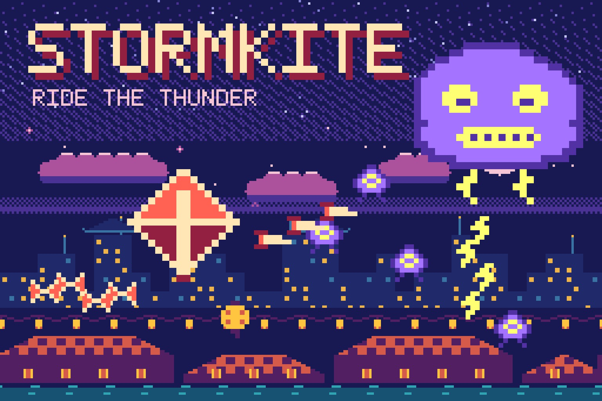
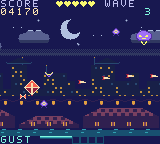

# Stormkite

**[Play online](https://chromatic.youens.com/games/stormkite/)** · [Download the GBC ROM](dist/stormkite.gbc)

A storm with a mind of its own is rolling over the lantern festival. Fly a paper kite above the harbor rooftops, pop storm wisps with darts, catch lanterns to charge your gust, and break the Thunderhead.



## How to play

Survive three waves over the harbor, then defeat the Thunderhead. Lanterns and defeated storm spirits charge the gust, which clears every bolt and damages everything on screen. Five hearts.

| Control | Action |
| --- | --- |
| D-pad / Arrows | Fly |
| A / X / Space | Fire darts (hold) |
| B / Z | Release a gust |
| Start / Enter | Start, pause, resume |
| Select / M | Toggle sound |

On the title screen, B opens the instructions. After a round, A or Start replays,
and B returns to the title. Best scores last for the current power-on session;
the [Chromatic Arcade cartridge](../arcade/) saves them.

The full design, including every number, is in [DESIGN.md](DESIGN.md).

## What makes it different

Scanline-interrupt parallax: three background bands read one seamless harbor map at different scroll speeds while the HUD rows stay pinned. Lightning and the dusk-to-storm sky are palette changes timed to vertical blank.



These are native 160 × 144 cartridge graphics. The cover is a pixel poster built
from the cartridge's own tiles, sprites and palette; see
[art/README.md](art/README.md). Native pixel assets are generated reproducibly by
[../shared/worlds.py](../shared/worlds.py).

## Build

Requires GBDK 4.5.0 and Python 3. From the repository root on Apple Silicon macOS:

```sh
./games/hello-dot/tools/setup.sh
make -C games/stormkite release
```

For another platform, install the appropriate official GBDK build and supply
`GBDK_HOME=/absolute/path/to/gbdk` to Make. Output is a 32 KiB, Color-only,
ROM-only cartridge at `dist/stormkite.gbc`. SHA-256 is in `dist/SHA256SUMS`.
The source shares [a small CGB runtime](../shared/README.md). The game is in
`src/main.c`; the scanline interrupt handlers are in `src/sky.c`.

## Validation and scope

Run `.tools/venv/bin/python tools/test_collection.py` from the repository root.
Test dependencies are pinned in `games/hello-dot/tools/requirements-test.txt`.
The suite checks the cartridge header, the 30 Hz update rate, help and pause.
A joypad-driven bot then completes the whole game in the emulator, so this
proves the game can be finished, not how hard it is for a person. Physical
Chromatic testing is still pending.

No network, AI API, special firmware, or battery-backed storage is required.
Use a compatible rewritable cartridge to play on your Chromatic. See the
[hardware development guide](../../docs/development.md) for loading options.

GBDK runtime license: [../hello-dot/licenses/GBDK.txt](../hello-dot/licenses/GBDK.txt).
